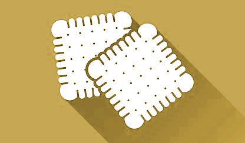

My mother has bought me a smartwatch to my birthday [2023], so
I own a [Xiaomi Watch 2 Pro](https://kekse.biz/?~hardware) now.

## My ["**Biscuits**" Collection](https://www.facer.io/collection/cake-collection-8e8db4066b)
Because I wanted a special watch face design (I really love 24h analog),
I decided to create my own one(s).

So I came up to [**facer.io**](https://facer.io/). There you can design as many as you want
absolutely for free (even if not everything is for free there).

I'm also presenting them on my [private website](https://kekse.biz/?~smartwatch),
and on my [Facer **kekse** profile](https://www.facer.io/u/kekse). .. AND here:
### [**`biscuits.casa`**](https://biscuits.casa/)
&nbsp;&nbsp;&nbsp;&nbsp;&nbsp;&nbsp;&nbsp;&nbsp;&nbsp;&nbsp;&nbsp;&nbsp;&nbsp;&nbsp;&nbsp;&nbsp;
&nbsp;&nbsp;&nbsp;&nbsp;&nbsp;&nbsp;&nbsp;&nbsp;&nbsp;&nbsp;&nbsp;&nbsp;&nbsp;&nbsp;&nbsp;&nbsp;

I made them all 'from scratch', as usual. Some are better, some are merely tryouts..
and here they are, with the original, animated `.webp` images (plus some transparency).

The **Inspector** is available for any of these.. there you'll my 'source codes' (maybe
interesting for you, because there is sometimes 'many' maths hidden in there; inter alia
all the rules of three, or even the sine and cosine positionings, etc.)! **;)~**

* [**`Cake View v2`**](#cake-view-v2)
* [**`Cake Rotate v2`**](#cake-rotate-v2)
* [**`Cake Second Try`**](#cake-second-try)
* [**`Cake Circle`**](#cake-circle)
* [**`Cake Uno v2`**](#cake-uno-v2)
* [**`Cake Uno v4`**](#cake-uno-v4)
* [**`Cake Rotate v1`**](#cake-rotate-v1)
* [**`Cake Binary`**](#cake-binary)
* [**`Cake First Try`**](#cake-first-try)

#### **`Cake View v2`**
| Key         | Value                                                                                                             |
| ----------: | :---------------------------------------------------------------------------------------------------------------- |
| Created     | **2024-04-07**                                                                                                    |
| Updated     | **2024-06-15**                                                                                                    |
| Website     | [`R8dBeYEsYO`](https://www.facer.io/watchface/R8dBeYEsYO?watchModel=fossilqmarshal)                               |
| Inspector   | [`R8dBeYEsYO`](https://www.facer.io/watchface/R8dBeYEsYO/inspect)                                                 |
| Preview     |                    |
| Description | My latest attempt.. everything at a glance. **Second version**!                                                   |

##### Details
- [x] Someone said: "so much fun!".. many colors.
- [x] Mainly: many "progress" items, to see all the time/date progresses at a glance!!
- [x] Digital and analog combined everywhere (**24h**)
- [x] Moon phase: a day counter and a moon icon
- [x] Wind direction and speed as strings (bottom/left), and the temperature..
- [x] Plus a progress for wind direction (calculated against compass, so it's dynamically moving!)
- [x] Compass around the clock (orange progress), and the watch battery level (yellow progress around)
- [x] Compass angle string and direction name
- [x] Weekday (left) also shows progress from monday to sunday(!)
- [x] Heart Beat (w/ sine animated icon)
- [x] "Everything" as a progress (see how far time has come... ;-)

#### **`Cake Rotate v2`**
| Key         | Value                                                                                                             |
| ----------: | :---------------------------------------------------------------------------------------------------------------- |
| Created     | **2023-12-28**                                                                                                    |
| Updated     | **2024-06-15**                                                                                                    |
| Website     | [`TUAAu6E5Hv`](https://www.facer.io/watchface/TUAAu6E5Hv?watchModel=fossilqmarshal)                               |
| Inspector   | [`TUAAu6E5Hv`](https://www.facer.io/watchface/TUAAu6E5Hv/inspect)                                                 |
| Preview     |              |
| Description | Better version of the original 'Cake Rotate v1'                                                                   |

##### Details
- [x] Big *rotating* analog clock
- [x] Phone and Watch Battery Levels near the middle (sine and cosine positioning)
- [x] My favicon in the center rotates with your compass, in the middle
- [x] Heart beat and step count (sine animated icon)
- [x] The digital Date with weekday on the top/right
- [x] *Percentage* of progress of [ Minute, Hour, Day, Week, Month, Year ], this time round alignment(!)

#### **`Cake Second Try`**
| Key         | Value                                                                                                             |
| ----------: | :---------------------------------------------------------------------------------------------------------------- |
| Created     | **10/2023**                                                                                                       |
| Updated     | **2024-06-15**                                                                                                    |
| Website     | [`nyWyzHmJeI`](https://www.facer.io/watchface/nyWyzHmJeI?watchModel=fossilqmarshal)                               |
| Inspector   | [`nyWyzHmJeI`](https://www.facer.io/watchface/nyWyzHmJeI/inspect)                                                 |
| Preview     |           |
| Description | My second try in designing own watch faces ..                                                                     |

##### Details
- [x] Digital time and date
- [x] Analog time (**24h**) (w/ nice looking second progress)
- [x] Analog Hour and Minute strings (plus arrows), positioned with sine and cosine (**24h**)
- [x] Phone and Watch battery levels (text and tiny progresses)
- [x] Red compass (progress) around the clock, and one in my favicon's rotation value
- [x] Some (digital) weather information
- [x] Heart beat rate (with sine animated heart icon)
- [x] GPS Coordinates (Latitude, Longitude, Altitude)

#### **`Cake Circle`**
| Key         | Value                                                                                                             |
| ----------: | :---------------------------------------------------------------------------------------------------------------- |
| Created     | **2024-06-08**                                                                                                    |
| Updated     | **2024-06-14**                                                                                                    |
| Website     | [`a5hQVcvoNO`](https://www.facer.io/watchface/a5hQVcvoNO?watchModel=fossilqmarshal)                               |
| Inspector   | [`a5hQVcvoNO`](https://www.facer.io/watchface/a5hQVcvoNO/inspect)                                                 |
| Preview     |                       |
| Description | In fact I wanted to dynamically change the circle's RADIUS values, but that wasn't possible at Facer. So their lengths are dynamic.|

##### Details
- [x] Digital time and date, rotating around with the analog time (24h)
- [x] The circles indicate the progresses of: Minute, Hour, Day, Week, Month and Year
- [x] In the middle a heart icon with the average beat rate (sine/cosine)
- [x] The both *thin* circles/progresses on the outside are battery and compass
- [x] The big, rotating arrow points to the analog time (24h) more precise

#### **`Cake Uno v2`**
| Key         | Value                                                                                                             |
| ----------: | :---------------------------------------------------------------------------------------------------------------- |
| Created     | **11/2023**                                                                                                       |
| Updated     | **2024-06-06**                                                                                                    |
| Website     | [`zIFEz0CL3d`](https://www.facer.io/watchface/zIFEz0CL3d?watchModel=fossilqmarshal)                               |
| Inspector   | [`zIFEz0CL3d`](https://www.facer.io/watchface/zIFEz0CL3d/inspect)                                                 |
| Preview     |                       |
| Description | Second Version of my first Version of a `Uno` clock                                                               |

##### Details
Similar to the watches with only one hand, but a bit optimized..

- [x] With a design smth. similar to "one hand" watches.. (but..)
- [x] The digital time rotates around in the position of the analog clock (it's hour, in 24h design)
- [x] The digital date rotates around the position of the month's progress
- [x] This date shows both the name and the number of the month
- [x] The digital weekday rotates around the position of the weekday progress of the week
- [x] The big green arrow on the outside indicates the current year's progress
- [x] In the center you'll see your heart beat (average?)
- [x] One progress around the clock is the compass
- [x] The other progress around is the watch battery level

#### **`Cake Uno v4`**
| Key         | Value                                                                                                             |
| ----------: | :---------------------------------------------------------------------------------------------------------------- |
| Created     | **2024-06-07**                                                                                                    |
| Updated     | **2024-06-27**                                                                                                    |
| Website     | [`CWbow8Ne6w`](https://www.facer.io/watchface/CWbow8Ne6w?watchModel=fossilqmarshal)                               |
| Inspector   | [`CWbow8Ne6w`](https://www.facer.io/watchface/CWbow8Ne6w/inspect)                                                 |
| Preview     |                       |
| Description | It's a `Uno` watch in the sense that i only got one hand for the hours and none for minutes and seconds.. the rest is improvisation and optimization.|

##### Details
- [x] The whole DIGITAL time/date rotate around with the (24!) hours in a day
- [x] Plus an additional hand for it (orange)
- [x] The progress of year (blue), month (green) and ween (yellow) in their own hands
- [x] The blue progress on the outside is a compass
- [x] The yellow progress on the outside is the watch battery indicator

#### **`Cake Rotate v1`**
| Key         | Value                                                                                                             |
| ----------: | :---------------------------------------------------------------------------------------------------------------- |
| Created     | **2023-12-26**                                                                                                    |
| Updated     | **2024-06-15**                                                                                                    |
| Website     | [`fTzAhsSKqm`](https://www.facer.io/watchface/fTzAhsSKqm?watchModel=fossilqmarshal)                               |
| Inspector   | [`fTzAhsSKqm`](https://www.facer.io/watchface/fTzAhsSKqm/inspect)                                                 |
| Preview     |              |
| Description | Something new after Christmas, before the new year arrives..                                                      |

##### Details
- [x] Big **rotating** analog clock (**24h**)
- [x] Phone and Watch Battery Levels near the middle (sine and cosine positioning)
- [x] My favicon in the center rotates with your compass, in the middle
- [x] Heart beat and step count (sine animated icon)
- [x] The digital Date with weekday on the bottom
- [x] *Percentage* of progress of [ Day, Week, Month, Year ]
- [x] Also nice design for "squared" watches, in my opinion

#### **`Cake Binary`**
| Key         | Value                                                                                                             |
| ----------: | :---------------------------------------------------------------------------------------------------------------- |
| Created     | **2023-11-20**                                                                                                    |
| Updated     | **2024-06-15**                                                                                                    |
| Website     | [`epwBfMhr92`](https://www.facer.io/watchface/epwBfMhr92?watchModel=fossilqmarshal)                               |
| Inspector   | [`epWBfMhr92`](https://www.facer.io/watchface/epwBfMhr92/inspect)                                                 |
| Preview     |                       |
| Description | For the geeks/nerds: binary digit system (base/radix = 2);                                                        |

##### Details
- [x] Five BITS on the left for the hour value
- [x] Six BITS on the top/right for minute value
- [x] Six BITS on the bottom for second value
- [x] Eight BITS for your heart Beat (w/ sine animated icon)
- [x] Most bits are sized by their weights
- [x] Analog clock in the middle (24h!)
- [x] Weekday string in the middle
- [x] Also in the middle: digital month in year and day in month
- [x] My favicon's transparency and rotation encodes the watch battery level
- [x] Watch Battery level also in the outer progress beneath the compass
- [x] A compass around the clock (blue progress)

#### **`Cake First Try`**
| Key         | Value                                                                                                             |
| ----------: | :---------------------------------------------------------------------------------------------------------------- |
| Created     | **10/2023**                                                                                                       |
| Updated     | **2024-06-15**                                                                                                    |
| Website     | [`HiMnnIpJCH`](https://www.facer.io/watchface/HiMnnIpJCH?watchModel=fossilqmarshal)                               |
| Inspector   | [`HiMnnIpJCH`](https://www.facer.io/watchface/HiMnnIpJCH/inspect)                                                 |
| Preview     |              |
| Description | My first try in making a watch face. Really not perfect..                                                         |

##### Details
- [x] Analog (**24h**) clock
- [x] Extra analog weekday and month
- [x] Additional analog "clock" for watch and phone battery levels
- [x] Heart beat rate (with sine animated icon)
- [x] Weather and Moon phase icons on the top
- [x] Digital time and the date (partially Strings)
- [x] A compass (red progress around the clock)

# Copyright and License
The Copyright is [(c) Sebastian Kucharczyk](COPYRIGHT.txt),
and it's licensed under the [MIT](LICENSE.txt) (also known as 'X' or 'X11' license).

